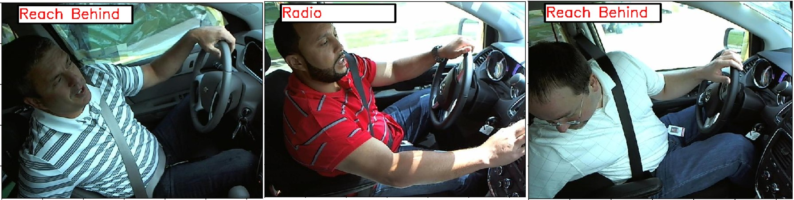
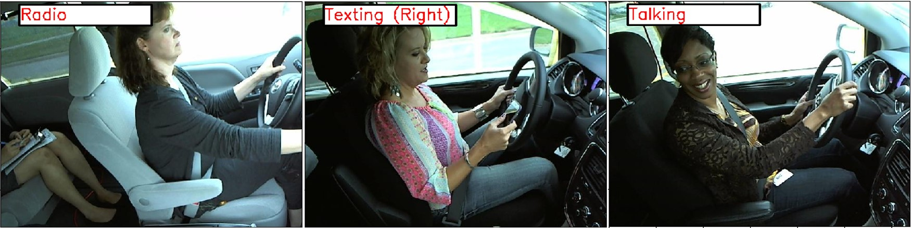
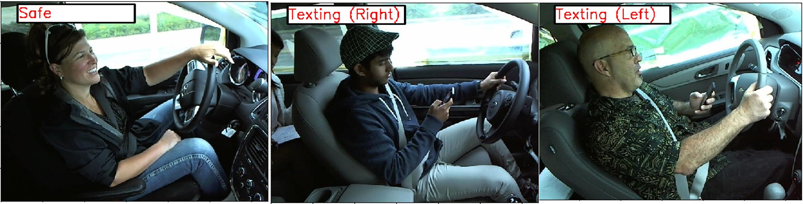
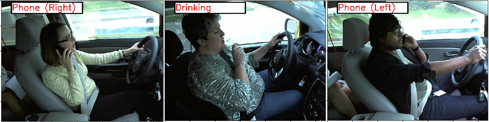

# Driver-Distraction-Detection
Identifying distracted drivers using Convolutional Neural Networks

Using state Farm's distracted driving dataset, we can identify 10 different classess of distraction including on the phone, using radio, doing hair and make-up etc.

Labels are:
```
{ 
  0: "Safe", 
  1: "Texting (Right)", 
  2: "Phone (Right)", 
  3: "Texting (Left)", 
  4: "Phone (Left)", 
  5: "Radio", 
  6: "Drinking", 
  7: "Reach Behind", 
  8: "Hair & Makeup", 
  9: "Talking"
}
```

## Setup
**Dependencies**:

- [x] Tensorflow
- [x] pandas
- [x] numpy
- [x] matplotlib

Training is done in ``driver_detection_train.py``, prediction is done in `driver_detection_predict.py` and `driver_detection_utils.py` provides helper functions
## Training
VGG16 and a basic Convolutional Neural Network were trained from scratch. Images were preprocessed by downsampling the image, converting to grayscale
and slicing a portion of the left hand-side image. Data was split (90-10) for training and validation and a seperate test dataset was used (see below). A generator was used (see `driver-detection-utils.py`) to feed batch_size images and labels for model training. 

## Results

<p align="center">
   
   
   
   
</p>
